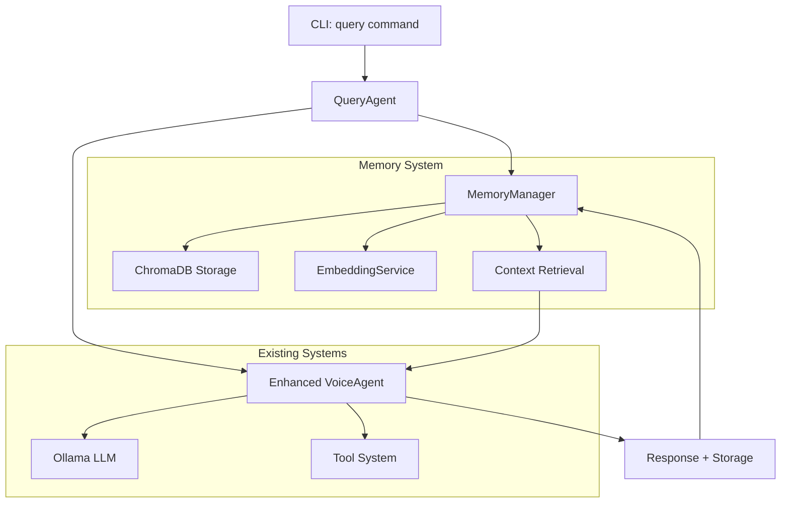

# Query Command with Vector Memory - Implementation Plan

## Overview

This document outlines the implementation plan for adding a new `query` command to the Transcriber AI Voice Agent with persistent memory capabilities using ChromaDB for semantic similarity-based context retrieval.

## Feature Requirements

### Core Functionality
- **Single Query Processing**: `poetry run transcriber query "What tools do you have access to?"`
- **Persistent Memory**: Remember information across invocations
- **Semantic Context**: Retrieve relevant past conversations using vector similarity
- **Privacy-First**: All processing remains local, no cloud dependencies
- **Integration**: Work alongside existing `chat` command and session system

### Example Usage Scenarios
```bash
# Store personal information
poetry run transcriber query "My name is John Rizzo"

# Retrieve stored information
poetry run transcriber query "What is my name?"
# Expected: "Your name is John Rizzo."

# Query with context
poetry run transcriber query "What tools do you have access to?"

# Verbose mode showing memory context
poetry run transcriber query "What did we discuss about my projects?" --verbose
```

## Architecture Overview



## Implementation Phases

### Phase 1: Memory System Foundation

#### 1.1 Dependencies and Configuration

**Add to `pyproject.toml`:**
```toml
# Vector database and embeddings
chromadb = "^0.4.0"
sentence-transformers = "^2.2.0"
```

**Extend `transcriber/config.py`:**
```python
class MemoryConfig(BaseModel):
    """Vector memory configuration."""
    enabled: bool = True
    chromadb_path: str = "./data/memory"
    collection_name: str = "transcriber_memory"
    
    # Embedding configuration
    embedding_strategy: str = "sentence_transformers"
    embedding_model: str = "all-MiniLM-L6-v2"
    
    # Context retrieval settings
    max_context_memories: int = 5
    similarity_threshold: float = 0.7
    context_window_days: int = 30
    
    # Performance optimization
    lazy_initialization: bool = True
    background_processing: bool = True
    embedding_cache_size: int = 1000
    
    # Memory lifecycle
    memory_retention_days: int = 365
    auto_cleanup_enabled: bool = True
    cleanup_interval_hours: int = 24
    
    # Privacy controls
    exclude_sensitive_patterns: list[str] = ["password", "secret", "token", "key"]

# Add to Settings class
class Settings(BaseSettings):
    # ... existing config
    memory: MemoryConfig = MemoryConfig()
```

#### 1.2 Memory Data Models

**Create `transcriber/memory/__init__.py`:**
```python
"""Memory system for persistent conversation context."""

from .manager import MemoryManager
from .models import MemoryEntry, MemoryContext
from .embeddings import EmbeddingService
from .storage import ChromaDBStorage

__all__ = [
    "MemoryManager",
    "MemoryEntry", 
    "MemoryContext",
    "EmbeddingService",
    "ChromaDBStorage"
]
```

**Create `transcriber/memory/models.py`:**
```python
"""Data models for memory system."""

from dataclasses import dataclass, asdict
from datetime import datetime
from typing import Optional, Dict, Any, List
from uuid import uuid4
import json


@dataclass
class MemoryEntry:
    """Individual memory entry with metadata."""
    id: str
    content: str
    entry_type: str  # "user_query", "assistant_response", "conversation"
    timestamp: datetime
    metadata: Dict[str, Any]
    embedding: Optional[List[float]] = None
    
    @classmethod
    def create_user_query(cls, content: str, **metadata) -> "MemoryEntry":
        """Create a user query memory entry."""
        return cls(
            id=str(uuid4()),
            content=content,
            entry_type="user_query",
            timestamp=datetime.now(),
            metadata=metadata
        )
    
    @classmethod
    def create_assistant_response(cls, content: str, **metadata) -> "MemoryEntry":
        """Create an assistant response memory entry."""
        return cls(
            id=str(uuid4()),
            content=content,
            entry_type="assistant_response", 
            timestamp=datetime.now(),
            metadata=metadata
        )
    
    def to_dict(self) -> Dict[str, Any]:
        """Convert to dictionary for storage."""
        data = asdict(self)
        data['timestamp'] = self.timestamp.isoformat()
        return data
    
    @classmethod
    def from_dict(cls, data: Dict[str, Any]) -> "MemoryEntry":
        """Create from dictionary."""
        data = data.copy()
        data['timestamp'] = datetime.fromisoformat(data['timestamp'])
        return cls(**data)


@dataclass
class MemoryContext:
    """Retrieved memory context for a query."""
    relevant_memories: List[MemoryEntry]
    similarity_scores: List[float]
    context_summary: str
    total_memories: int
    query_embedding: Optional[List[float]] = None
    
    def get_context_text(self) -> str:
        """Get formatted context text for prompt inclusion."""
        if not self.relevant_memories:
            return ""
        
        context_lines = ["Previous relevant conversations:"]
        for memory in self.relevant_memories:
            timestamp = memory.timestamp.strftime("%Y-%m-%d %H:%M")
            context_lines.append(f"[{timestamp}] {memory.entry_type}: {memory.content}")
        
        return "\n".join(context_lines)
    
    def has_relevant_context(self) -> bool:
        """Check if there's relevant context to include."""
        return len(self.relevant_memories) > 0


@dataclass
class QueryResult:
    """Result of a query processing operation."""
    query: str
    response: str
    memory_context: Optional[MemoryContext]
    processing_time: float
    tokens_used: Optional[int] = None
    error: Optional[str] = None
    
    def to_dict(self) -> Dict[str, Any]:
        """Convert to dictionary."""
        return {
            "query": self.query,
            "response": self.response,
            "has_memory_context": self.memory_context is not None,
            "context_memories_count": len(self.memory_context.relevant_memories) if self.memory_context else 0,
            "processing_time": self.processing_time,
            "tokens_used": self.tokens_used,
            "error": self.error
        }
```

#### 1.3 Embedding Service

**Create `transcriber/memory/embeddings.py`:**
```python
"""Embedding service for generating text embeddings."""

import logging
from typing import List, Optional, Dict, Any
import asyncio
from functools import lru_cache

logger = logging.getLogger(__name__)


class EmbeddingService:
    """Service for generating text embeddings with caching and fallbacks."""
    
    def __init__(self, config):
        self.config = config
        self.model = None
        self.strategy = None
        self._cache: Dict[str, List[float]] = {}
        self._initialized = False
    
    async def initialize(self) -> None:
        """Initialize embedding model with fallback chain."""
        if self._initialized:
            return
        
        try:
            # Primary: SentenceTransformers (local, high quality)
            from sentence_transformers import SentenceTransformer
            self.model = SentenceTransformer(self.config.embedding_model)
            self.strategy = "sentence_transformers"
            logger.info(f"Initialized SentenceTransformers with model: {self.config.embedding_model}")
            
        except ImportError as e:
            logger.warning(f"SentenceTransformers not available: {e}")
            try:
                # Fallback: Simple TF-IDF (basic but functional)
                from sklearn.feature_extraction.text import TfidfVectorizer
                self.model = TfidfVectorizer(max_features=384, stop_words='english')
                self.strategy = "tfidf"
                logger.warning("Using TF-IDF fallback for embeddings")
                
            except ImportError:
                raise RuntimeError("No embedding strategy available. Install sentence-transformers or scikit-learn.")
        
        self._initialized = True
    
    async def embed_text(self, text: str) -> List[float]:
        """Generate embedding for a single text."""
        await self.initialize()
        
        # Check cache first
        cache_key = self._get_cache_key(text)
        if cache_key in self._cache:
            return self._cache[cache_key]
        
        # Generate embedding
        if self.strategy == "sentence_transformers":
            # Run in thread pool to avoid blocking
            loop = asyncio.get_event_loop()
            embedding = await loop.run_in_executor(
                None, 
                lambda: self.model.encode(text, convert_to_tensor=False).tolist()
            )
        elif self.strategy == "tfidf":
            # TF-IDF requires fitting on corpus first
            embedding = await self._tfidf_embed(text)
        else:
            raise RuntimeError(f"Unknown embedding strategy: {self.strategy}")
        
        # Cache result with LRU eviction
        self._cache_embedding(cache_key, embedding)
        return embedding
    
    async def embed_batch(self, texts: List[str]) -> List[List[float]]:
        """Generate embeddings for multiple texts efficiently."""
        await self.initialize()
        
        if self.strategy == "sentence_transformers":
            loop = asyncio.get_event_loop()
            embeddings = await loop.run_in_executor(
                None,
                lambda: self.model.encode(texts, convert_to_tensor=False).tolist()
            )
            return embeddings
        else:
            # Fallback to individual processing
            return [await self.embed_text(text) for text in texts]
    
    def _get_cache_key(self, text: str) -> str:
        """Generate cache key for text."""
        # Simple hash-based key (could use more sophisticated approach)
        return str(hash(text.strip().lower()))
    
    def _cache_embedding(self, key: str, embedding: List[float]) -> None:
        """Cache embedding with LRU eviction."""
        if len(self._cache) >= self.config.embedding_cache_size:
            # Remove oldest entry (simple FIFO, could use proper LRU)
            oldest_key = next(iter(self._cache))
            del self._cache[oldest_key]
        
        self._cache[key] = embedding
    
    async def _tfidf_embed(self, text: str) -> List[float]:
        """Generate TF-IDF embedding (fallback method)."""
        # This is a simplified implementation
        # In practice, you'd need to maintain a corpus for proper TF-IDF
        words = text.lower().split()
        # Create a simple bag-of-words vector (384 dimensions)
        embedding = [0.0] * 384
        for i, word in enumerate(words[:384]):
            embedding[i] = hash(word) % 100 / 100.0  # Normalized hash
        return embedding
    
    def get_embedding_dimension(self) -> int:
        """Get the dimension of embeddings produced by this service."""
        if self.strategy == "sentence_transformers":
            return self.model.get_sentence_embedding_dimension()
        else:
            return 384  # Default dimension for fallback methods
    
    def clear_cache(self) -> None:
        """Clear the embedding cache."""
        self._cache.clear()
        logger.info("Embedding cache cleared")
```

#### 1.4 ChromaDB Storage Layer

**Create `transcriber/memory/storage.py`:**
```python
"""ChromaDB storage layer for vector memory."""

import logging
from datetime import datetime, timedelta
from typing import List, Optional, Dict, Any
from pathlib import Path
import json

from .models import MemoryEntry

logger = logging.getLogger(__name__)


class ChromaDBStorage:
    """ChromaDB storage layer with optimizations for voice agent."""
    
    def __init__(self, config, embedding_service):
        self.config = config
        self.embedding_service = embedding_service
        self.client = None
        self.collection = None
        self._initialized = False
    
    async def initialize(self) -> None:
        """Initialize ChromaDB with persistent storage."""
        if self._initialized:
            return
        
        try:
            import chromadb
            from chromadb.config import Settings as ChromaSettings
            
            # Ensure storage directory exists
            storage_path = Path(self.config.chromadb_path)
            storage_path.mkdir(parents=True, exist_ok=True)
            
            # Configure ChromaDB for local persistence
            self.client = chromadb.PersistentClient(
                path=str(storage_path),
                settings=ChromaSettings(
                    anonymized_telemetry=False,  # Privacy-first
                    allow_reset=False
                )
            )
            
            # Create or get collection
            self.collection = self.client.get_or_create_collection(
                name=self.config.collection_name,
                metadata={"hnsw:space": "cosine"}  # Use cosine similarity
            )
            
            logger.info(f"ChromaDB initialized at {storage_path}")
            self._initialized = True
            
        except ImportError:
            raise RuntimeError("ChromaDB not installed. Run: pip install chromadb")
        except Exception as e:
            logger.error(f"Failed to initialize ChromaDB: {e}")
            raise
    
    async def store_memory(self, memory: MemoryEntry) -> None:
        """Store a memory entry in ChromaDB."""
        await self.initialize()
        
        try:
            # Generate embedding if not present
            if not memory.embedding:
                memory.embedding = await self.embedding_service.embed_text(memory.content)
            
            # Prepare metadata for ChromaDB
            metadata = {
                "entry_type": memory.entry_type,
                "timestamp": memory.timestamp.isoformat(),
                **memory.metadata
            }
            
            # Add to collection
            self.collection.add(
                embeddings=[memory.embedding],
                documents=[memory.content],
                metadatas=[metadata],
                ids=[memory.id]
            )
            
            logger.debug(f"Stored memory: {memory.id} ({memory.entry_type})")
            
        except Exception as e:
            logger.error(f"Failed to store memory {memory.id}: {e}")
            raise
    
    async def similarity_search(
        self,
        query_embedding: List[float],
        n_results: int = 5,
        where: Optional[Dict[str, Any]] = None
    ) -> List[Dict[str, Any]]:
        """Search for similar memories using vector similarity."""
        await self.initialize()
        
        try:
            # Build where clause for filtering
            where_clause = {}
            if where:
                where_clause.update(where)
            
            # Add time-based filtering if configured
            if self.config.context_window_days > 0:
                cutoff_date = datetime.now() - timedelta(days=self.config.context_window_days)
                where_clause["timestamp"] = {"$gte": cutoff_date.isoformat()}
            
            # Perform similarity search
            results = self.collection.query(
                query_embeddings=[query_embedding],
                n_results=n_results,
                where=where_clause if where_clause else None,
                include=["documents", "metadatas", "distances"]
            )
            
            # Format results
            formatted_results = []
            if results["documents"] and results["documents"][0]:
                for i, doc in enumerate(results["documents"][0]):
                    formatted_results.append({
                        "id": results["ids"][0][i],
                        "content": doc,
                        "metadata": results["metadatas"][0][i],
                        "distance": results["distances"][0][i],
                        "score": 1.0 - results["distances"][0][i]  # Convert distance to similarity
                    })
            
            # Filter by similarity threshold
            filtered_results = [
                r for r in formatted_results 
                if r["score"] >= self.config.similarity_threshold
            ]
            
            logger.debug(f"Found {len(filtered_results)} relevant memories")
            return filtered_results
            
        except Exception as e:
            logger.error(f"Similarity search failed: {e}")
            return []
    
    async def get_memory_count(self) -> int:
        """Get total number of stored memories."""
        await self.initialize()
        
        try:
            return self.collection.count()
        except Exception as e:
            logger.error(f"Failed to get memory count: {e}")
            return 0
    
    async def cleanup_old_memories(self, days_old: int) -> int:
        """Clean up memories older than specified days."""
        await self.initialize()
        
        try:
            cutoff_date = datetime.now() - timedelta(days=days_old)
            
            # Query old memories
            old_memories = self.collection.query(
                query_embeddings=[[0.0] * self.embedding_service.get_embedding_dimension()],
                n_results=10000,  # Large number to get all
                where={"timestamp": {"$lt": cutoff_date.isoformat()}},
                include=["metadatas"]
            )
            
            if old_memories["ids"] and old_memories["ids"][0]:
                # Delete old memories
                self.collection.delete(ids=old_memories["ids"][0])
                deleted_count = len(old_memories["ids"][0])
                logger.info(f"Cleaned up {deleted_count} old memories")
                return deleted_count
            
            return 0
            
        except Exception as e:
            logger.error(f"Memory cleanup failed: {e}")
            return 0
    
    async def close(self) -> None:
        """Close ChromaDB connection."""
        # ChromaDB handles cleanup automatically
        logger.info("ChromaDB storage closed")
```

#### 1.5 Memory Manager

**Create `transcriber/memory/manager.py`:**
```python
"""Main memory manager coordinating all memory operations."""

import logging
from datetime import datetime, timedelta
from typing import List, Optional, Dict, Any
import asyncio

from .models import MemoryEntry, MemoryContext, QueryResult
from .embeddings import EmbeddingService
from .storage import ChromaDBStorage

logger = logging.getLogger(__name__)


class MemoryManager:
    """High-level memory management interface."""
    
    def __init__(self, config):
        self.config = config
        self.embedding_service = EmbeddingService(config)
        self.storage = ChromaDBStorage(config, self.embedding_service)
        self._initialized = False
        self._background_tasks = set()
    
    async def initialize(self) -> None:
        """Initialize memory manager and all components."""
        if self._initialized:
            return
        
        if not self.config.enabled:
            logger.info("Memory system disabled by configuration")
            return
        
        logger.info("Initializing memory manager...")
        
        try:
            # Initialize components
            await self.embedding_service.initialize()
            await self.storage.initialize()
            
            # Start background cleanup if enabled
            if self.config.auto_cleanup_enabled:
                self._start_background_cleanup()
            
            self._initialized = True
            logger.info("Memory manager initialized successfully")
            
        except Exception as e:
            logger.error(f"Failed to initialize memory manager: {e}")
            raise
    
    async def store_interaction(
        self,
        query: str,
        response: str,
        metadata: Optional[Dict[str, Any]] = None
    ) -> None:
        """Store a query-response interaction in memory."""
        if not self.config.enabled:
            return
        
        await self.initialize()
        
        try:
            base_metadata = metadata or {}
            base_metadata.update({
                "interaction_id": f"interaction_{datetime.now().timestamp()}",
                "source": "query_command"
            })
            
            # Create memory entries
            user_memory = MemoryEntry.create_user_query(query, **base_metadata)
            assistant_memory = MemoryEntry.create_assistant_response(response, **base_metadata)
            
            # Store in background if configured
            if self.config.background_processing:
                self._schedule_background_storage([user_memory, assistant_memory])
            else:
                await self.storage.store_memory(user_memory)
                await self.storage.store_memory(assistant_memory)
            
            logger.debug("Stored interaction in memory")
            
        except Exception as e:
            logger.error(f"Failed to store interaction: {e}")
    
    async def retrieve_context(
        self,
        query: str,
        max_memories: Optional[int] = None
    ) -> MemoryContext:
        """Retrieve relevant memory context for a query."""
        if not self.config.enabled:
            return MemoryContext([], [], "", 0)
        
        await self.initialize()
        
        try:
            # Generate query embedding
            query_embedding = await self.embedding_service.embed_text(query)
            
            # Search for similar memories
            max_results = max_memories or self.config.max_context_memories
            search_results = await self.storage.similarity_search(
                query_embedding=query_embedding,
                n_results=max_results * 2,  # Get more to allow for ranking
                where={"entry_type": {"$in": ["user_query", "assistant_response"]}}
            )
            
            # Convert to memory entries and rank
            memories = []
            scores = []
            
            for result in search_results:
                memory_data = {
                    "id": result["id"],
                    "content": result["content"],
                    "entry_type": result["metadata"]["entry_type"],
                    "timestamp": datetime.fromisoformat(result["metadata"]["timestamp"]),
                    "metadata": {k: v for k, v in result["metadata"].items() 
                               if k not in ["entry_type", "timestamp"]}
                }
                
                memory = MemoryEntry(**memory_data)
                memories.append(memory)
                scores.append(result["score"])
            
            # Rank and select top memories
            ranked_memories = self._rank_memories(query, memories, scores)[:max_results]
            ranked_scores = scores[:len(ranked_memories)]
            
            # Generate context summary
            context_summary = self._generate_context_summary(ranked_memories)
            
            return MemoryContext(
                relevant_memories=ranked_memories,
                similarity_scores=ranked_scores,
                context_summary=context_summary,
                total_memories=len(ranked_memories),
                query_embedding=query_embedding
            )
            
        except Exception as e:
            logger.error(f"Failed to retrieve context: {e}")
            return MemoryContext([], [], "", 0)
    
    def _rank_memories(
        self,
        query: str,
        memories: List[MemoryEntry],
        scores: List[float]
    ) -> List[MemoryEntry]:
        """Rank memories by relevance, recency, and importance."""
        if not memories:
            return []
        
        ranked_items = []
        
        for memory, score in zip(memories, scores):
            # Calculate recency boost (more recent = higher boost)
            days_old = (datetime.now() - memory.timestamp).days
            recency_boost = max(0, 1.0 - (days_old / 30.0))  # Boost decays over 30 days
            
            # Calculate importance boost (user queries about personal info)
            importance_boost = 0.0
            personal_keywords = ["my name", "i am", "i'm", "my", "me"]
            if any(keyword in memory.content.lower() for keyword in personal_keywords):
                importance_boost = 0.3
            
            # Calculate conversation pair boost (query-response pairs)
            conversation_boost = 0.0
            if memory.entry_type == "assistant_response":
                conversation_boost = 0.2
            
            # Final score
            final_score = score * (1.0 + recency_boost + importance_boost + conversation_boost)
            ranked_items.append((memory, final_score))
        
        # Sort by final score
        ranked_items.sort(key=lambda x: x[1], reverse=True)
        return [memory for memory, _ in ranked_items]
    
    def _generate_context_summary(self, memories: List[MemoryEntry]) -> str:
        """Generate a summary of the memory context."""
        if not memories:
            return "No relevant context found."
        
        memory_types = {}
        for memory in memories:
            memory_types[memory.entry_type] = memory_types.get(memory.entry_type, 0) + 1
        
        summary_parts = []
        if memory_types.get("user_query", 0) > 0:
            summary_parts.append(f"{memory_types['user_query']} previous queries")
        if memory_types.get("assistant_response", 0) > 0:
            summary_parts.append(f"{memory_types['assistant_response']} previous responses")
        
        return f"Found {len(memories)} relevant memories: {', '.join(summary_parts)}"
    
    def _schedule_background_storage(self, memories: List[MemoryEntry]) -> None:
        """Schedule memory storage in background."""
        task = asyncio.create_task(self._background_store_memories(memories))
        self._background_tasks.add(task)
        task.add_done_callback(self._background_tasks.discard)
    
    async def _background_store_memories(self, memories: List[MemoryEntry]) -> None:
        """Store memories in background."""
        try:
            for memory in memories:
                await self.storage.store_memory(memory)
        except Exception as e:
            logger.error(f"Background storage failed: {e}")
    
    def _start_background_cleanup(self) -> None:
        """Start background cleanup task."""
        task = asyncio.create_task(self._background_cleanup_loop())
        self._background_tasks.add(task)
        task.add_done_callback(self._background_tasks.discard)
    
    async def _background_cleanup_loop(self) -> None:
        """Background cleanup loop."""
        while True:
            try:
                await asyncio.sleep(self.config.cleanup_interval_hours * 3600)
                deleted_count = await self.storage.cleanup_old_memories(
                    self.config.memory_retention_days
                )
                if deleted_count > 0:
                    logger.info(f"Background cleanup removed {deleted_count} old memories")
            except Exception as e:
                logger.error(f"Background cleanup error: {e}")
    
    async def get_memory_statistics(self) -> Dict[str, Any]:
        """Get memory system statistics."""
        if not self.config.enabled:
            return {"enabled": False}
        
        await self.initialize()
        
        try:
            total_memories = await self.storage.get_memory_count()
            
            return {
                "enabled": True,
                "total_memories": total_memories,
                "embedding_model": self.config.embedding_model,
                "embedding_strategy": self.embedding_service.strategy,
                "cache_size": len(self.embedding_service._cache),
                "storage_path": self.config.chromadb_path
            }
        except Exception as e:
            logger.error(f"Failed to get memory statistics: {e}")
            return {"enabled": True, "error": str(e)}
    
    async def cleanup_old_memories(self, days_old: Optional[int] = None) -> int:
        """Manually trigger cleanup of old memories."""
        if not self.config.enabled:
            return 0
        
        await self.initialize()
        days = days_old or self.config.memory_retention_days
        return await self.storage.cleanup_old_memories(days)
    
    async def close(self) -> None:
        """Close memory manager and cleanup resources."""
        # Cancel background tasks
        for task in self._background_tasks:
            task.cancel()
        
        if self._background_tasks:
            await asyncio.gather(*self._background_tasks, return_exceptions=True)
        
        # Close storage
        await self.storage.close()
        
        # Clear caches
        self.embedding_service.clear_cache()
        
        logger.info("Memory manager closed")
```

### Phase 2: Query Command Implementation

#### 2.1 Query Agent

**Create `transcriber/agent/query_agent.py`:**
```python
"""Specialized agent for single query processing with memory."""

import logging
import time
from typing import Optional

from ..config import Settings
from ..memory import MemoryManager
from ..memory.models import QueryResult
from .core import VoiceAgent

logger = logging.getLogger(__name__)


class QueryAgent:
    """Agent specialized for single query processing with memory context."""
    
    def __init__(self, settings: Settings):
        self.settings = settings
        self.voice_agent = VoiceAgent(settings)
        
        # Initialize memory manager if enabled
        if settings.memory.enabled:
            self.memory_manager = MemoryManager(settings.memory)
        else:
            self.memory_manager = None
        
        self._initialized = False
    
    async def initialize(self) -> None:
        """Initialize the query agent."""
        if self._initialized:
            return
        
        logger.info("Initializing query agent...")
        
        # Initialize voice agent
        await self.voice_agent.initialize()
        
        # Initialize memory manager
        if self.memory_manager:
            await self.memory_manager.initialize()
        
        self._initialized = True
        logger.info("Query agent initialized")
    
    async def process_query(
        self,
        query: str,
        use_memory: bool = True,
        store_interaction: bool = True,
        verbose: bool = False
    ) -> QueryResult:
        """Process a single query with optional memory context."""
        start_time = time.time()
        
        try:
            await self.initialize()
            
            # Retrieve memory context if enabled
            memory_context = None
            if use_memory and self.memory_manager:
                memory_context = await self.memory_manager.retrieve_context(query)
                
                if verbose and memory_context.has_relevant_context():
                    logger.info(f"Retrieved {len(memory_context.relevant_memories)} relevant memories")
            
            # Build enhanced prompt with memory context
            if memory_context and memory_context.has_relevant_context():
                enhanced_prompt = self._build_memory_enhanced_prompt(
                    self.voice_agent.system_prompt,
                    memory_context
                )
            else:
                enhanced_prompt = self.voice_agent.system_prompt
            
            # Process query with enhanced context
            original_prompt = self.voice_agent.system_prompt
            self.voice_agent.system_prompt = enhanced_prompt
            try:
                response = await self.voice_agent.process_text_input(query)
            finally:
                # Restore original prompt
                self.voice_agent.system_prompt = original_prompt
            
            # Store interaction in memory if enabled
            if store_interaction and self.memory_manager:
                await self.memory_manager.store_interaction(
                    query=query,
                    response=response,
                    metadata={
                        "processing_time": time.time() - start_time,
                        "memory_context_used": memory_context is not None,
                        "context_memories_count": len(memory_context.relevant_memories) if memory_context else 0
                    }
                )
            
            processing_time = time.time() - start_time
            
            return QueryResult(
                query=query,
                response=response,
                memory_context=memory_context,
                processing_time=processing_time
            )
            
        except Exception as e:
            logger.error(f"Query processing failed: {e}")
            return QueryResult(
                query=query,
                response=f"Sorry, I encountered an error: {str(e)}",
                memory_context=None,
                processing_time=time.time() - start_time,
                error=str(e)
            )
    
    def _build_memory_enhanced_prompt(self, base_prompt: str, memory_context) -> str:
        """Build system prompt enhanced with memory context."""
        if not memory_context or not memory_context.has_relevant_context():
            return base_prompt
        
        context_section = f"""

RELEVANT CONVERSATION HISTORY:
{memory_context.get_context_text()}

Please use this context to provide more personalized and informed responses. If the user asks about something mentioned in the conversation history, reference it appropriately.
"""
        
        return base_prompt + context_section
    
    async def get_memory_statistics(self) -> dict:
        """Get memory system statistics."""
        if not self.memory_manager:
            return {"memory_enabled": False}
        
        return await self.memory_manager.get_memory_statistics()
    
    async def cleanup(self) -> None:
        """Clean up query agent resources."""
        if self.memory_manager:
            await self.memory_manager.close()
        
        await self.voice_agent.cleanup()
        logger.info("Query agent cleaned up")
```

#### 2.2 CLI Command Implementation

**Add to `transcriber/main.py`:**
```python
@app.command()
def query(
    message: str = typer.Argument(..., help="Query message to send to the agent"),
    model: str = typer.Option(
        "llama3.2:3b", "--model", "-m", help="Ollama model to use"
    ),
    memory: bool = typer.Option(
        True, "--memory/--no-memory", help="Enable memory context retrieval"
    ),
    verbose: bool = typer.Option(
        False, "--verbose", "-v", help="Show memory context and metadata"
    ),
    store: bool = typer.Option(
        True, "--store/--no-store", help="Store this interaction in memory"
    ),
):
    """Send a single query to the agent with persistent memory."""
    import asyncio
    from .agent.query_agent import QueryAgent
    from .config import settings
    from rich.panel import Panel
    from rich.syntax import Syntax
    import json
    
    async def process_query_async():
        # Update model setting
        settings.agent.model = model
        
        # Create and initialize query agent
        query_agent = QueryAgent(settings)
        
        try:
            # Show processing indicator
            if verbose:
                console.print(f"[cyan]Processing query with model:[/cyan] {model}")
                console.print(f"[cyan]Memory enabled:[/cyan] {memory}")
            
            # Process the query
            result = await query_agent.process_query(
                query=message,
                use_memory=memory,
                store_interaction=store,
                verbose=verbose
            )
            
            # Display results
            if result.error:
                console.print(f"[red]Error:[/red] {result.error}")
                return
            
            # Show memory context if verbose and available
            if verbose and result.memory_context and result.memory_context.has_relevant_context():
                context_panel = Panel(
                    result.memory_context.get_context_text(),
                    title="[yellow]Memory Context Used[/yellow]",
                    border_style="yellow"
                )
                console.print(context_panel)
                console.print()
            
            # Show main response
            response_panel = Panel(
                result.response,
                title="[green]Agent Response[/green]",
                border_style="green"
            )
            console.print(response_panel)
            
            # Show metadata if verbose
            if verbose:
                metadata = {
                    "processing_time": f"{result.processing_time:.2f}s",
                    "memory_context_used": result.memory_context is not None,
                    "relevant_memories": len(result.memory_context.relevant_memories) if result.memory_context else 0
                }
                
                metadata_text = json.dumps(metadata, indent=2)
                metadata_panel = Panel(
                    Syntax(metadata_text, "json", theme="monokai"),
                    title="[blue]Processing Metadata[/blue]",
                    border_style="blue"
                )
                console.print(metadata_panel)
        
        finally:
            await query_agent.cleanup()
    
    # Run the async query processing
    asyncio.run(process_query_async())


@app.command()
def memory_stats():
    """Show memory system statistics and status."""
    import asyncio
    from .memory import MemoryManager
    from .config import settings
    from rich.table import Table
    
    async def show_memory_stats():
        if not settings.memory.enabled:
            console.print("[yellow]Memory system is disabled[/yellow]")
            return
        
        memory_manager = MemoryManager(settings.memory)
        
        try:
            stats = await memory_manager.get_memory_statistics()
            
            # Create statistics table
            table = Table(title="Memory System Statistics")
            table.add_column("Metric", style="cyan")
            table.add_column("Value", style="white")
            
            table.add_row("Status", "✅ Enabled" if stats.get("enabled") else "❌ Disabled")
            table.add_row("Total Memories", str(stats.get("total_memories", "Unknown")))
            table.add_row("Embedding Model", stats.get("embedding_model", "Unknown"))
            table.add_row("Embedding Strategy", stats.get("embedding_strategy", "Unknown"))
            table.add_row("Cache Size", str(stats.get("cache_size", "Unknown")))
            table.add_row("Storage Path", stats.get("storage_path", "Unknown"))
            
            console.print(table)
            
            if stats.get("error"):
                console.print(f"[red]Error:[/red] {stats['error']}")
        
        finally:
            await memory_manager.close()
    
    asyncio.run(show_memory_stats())


@app.command()
def memory_cleanup(
    days: int = typer.Option(
        30, "--days", "-d", help="Delete memories older than this many days"
    ),
    confirm: bool = typer.Option(
        False, "--confirm", "-y", help="Skip confirmation prompt"
    ),
):
    """Clean up old memories from the vector database."""
    import asyncio
    from .memory import MemoryManager
    from .config import settings
    
    async def cleanup_memories():
        if not settings.memory.enabled:
            console.print("[yellow]Memory system is disabled[/yellow]")
            return
        
        if not confirm:
            response = typer.confirm(
                f"This will delete all memories older than {days} days. Continue?"
            )
            if not response:
                console.print("Cleanup cancelled")
                return
        
        memory_manager = MemoryManager(settings.memory)
        
        try:
            console.print(f"[cyan]Cleaning up memories older than {days} days...[/cyan]")
            deleted_count = await memory_manager.cleanup_old_memories(days)
            
            if deleted_count > 0:
                console.print(f"[green]Successfully deleted {deleted_count} old memories[/green]")
            else:
                console.print("[yellow]No old memories found to delete[/yellow]")
        
        except Exception as e:
            console.print(f"[red]Cleanup failed:[/red] {e}")
        
        finally:
            await memory_manager.close()
    
    asyncio.run(cleanup_memories())
```

### Phase 3: Integration and Testing

#### 3.1 Configuration Integration

**Update `transcriber/config.py` to include MemoryConfig:**
```python
# Add the MemoryConfig class from Phase 1.1 above

# Update Settings class
class Settings(BaseSettings):
    """Main application settings."""
    
    # Existing configurations...
    audio: AudioConfig = AudioConfig()
    agent: AgentConfig = AgentConfig()
    voice: VoiceConfig = VoiceConfig()
    whisper: WhisperConfig = WhisperConfig()
    piper: PiperConfig = PiperConfig()
    session: SessionConfig = SessionConfig()
    performance: PerformanceConfig = PerformanceConfig()
    
    # New memory configuration
    memory: MemoryConfig = MemoryConfig()
    
    # Rest of existing Settings class...
```

#### 3.2 Enhanced Agent Integration

**Update `transcriber/agent/core.py` to support memory:**
```python
# Add memory integration to VoiceAgent class
class VoiceAgent:
    def __init__(self, settings: Settings):
        # ... existing initialization
        
        # Memory integration
        if settings.memory.enabled:
            from ..memory import MemoryManager
            self.memory_manager = MemoryManager(settings.memory)
        else:
            self.memory_manager = None
    
    async def initialize(self) -> None:
        """Initialize all agent components."""
        # ... existing initialization
        
        # Initialize memory manager if enabled
        if self.memory_manager:
            await self.memory_manager.initialize()
    
    async def cleanup(self) -> None:
        """Clean up agent resources."""
        # ... existing cleanup
        
        # Close memory manager
        if self.memory_manager:
            await self.memory_manager.close()
```

### Phase 4: Testing and Validation

#### 4.1 Unit Tests

**Create `tests/test_memory_system.py`:**
```python
"""Tests for the memory system."""

import pytest
import asyncio
from datetime import datetime
from unittest.mock import Mock, AsyncMock

from transcriber.memory import MemoryManager, MemoryEntry, MemoryContext
from transcriber.memory.embeddings import EmbeddingService
from transcriber.memory.storage import ChromaDBStorage
from transcriber.config import MemoryConfig


@pytest.fixture
def memory_config():
    """Test memory configuration."""
    return MemoryConfig(
        enabled=True,
        chromadb_path="./test_data/memory",
        embedding_model="all-MiniLM-L6-v2",
        max_context_memories=3,
        similarity_threshold=0.5
    )


@pytest.fixture
async def memory_manager(memory_config):
    """Test memory manager."""
    manager = MemoryManager(memory_config)
    await manager.initialize()
    yield manager
    await manager.close()


@pytest.mark.asyncio
async def test_store_and_retrieve_interaction(memory_manager):
    """Test storing and retrieving interactions."""
    # Store an interaction
    await memory_manager.store_interaction(
        query="My name is John Rizzo",
        response="Nice to meet you, John!"
    )
    
    # Retrieve context for related query
    context = await memory_manager.retrieve_context("What is my name?")
    
    assert context.has_relevant_context()
    assert len(context.relevant_memories) > 0
    assert any("John Rizzo" in memory.content for memory in context.relevant_memories)


@pytest.mark.asyncio
async def test_memory_ranking(memory_manager):
    """Test memory ranking by relevance and recency."""
    # Store multiple interactions
    interactions = [
        ("My name is John", "Hello John!"),
        ("I like pizza", "Pizza is great!"),
        ("What's the weather?", "I don't have weather data."),
        ("My favorite color is blue", "Blue is a nice color!")
    ]
    
    for query, response in interactions:
        await memory_manager.store_interaction(query, response)
    
    # Query for personal information
    context = await memory_manager.retrieve_context("Tell me about myself")
    
    # Should prioritize personal information
    personal_memories = [
        m for m in context.relevant_memories
        if any(word in m.content.lower() for word in ["john", "blue", "pizza"])
    ]
    
    assert len(personal_memories) > 0


@pytest.mark.asyncio
async def test_memory_cleanup(memory_manager):
    """Test memory cleanup functionality."""
    # Store some interactions
    await memory_manager.store_interaction("Test query", "Test response")
    
    # Get initial count
    stats = await memory_manager.get_memory_statistics()
    initial_count = stats["total_memories"]
    
    # Cleanup (should not delete recent memories)
    deleted = await memory_manager.cleanup_old_memories(days_old=1)
    
    # Should not delete recent memories
    assert deleted == 0
    
    # Cleanup very old memories (should delete all)
    deleted = await memory_manager.cleanup_old_memories(days_old=0)
    assert deleted >= 0  # May be 0 if no memories to delete


class TestEmbeddingService:
    """Test embedding service functionality."""
    
    @pytest.mark.asyncio
    async def test_embedding_generation(self, memory_config):
        """Test embedding generation."""
        service = EmbeddingService(memory_config)
        await service.initialize()
        
        # Generate embedding
        embedding = await service.embed_text("Hello world")
        
        assert isinstance(embedding, list)
        assert len(embedding) > 0
        assert all(isinstance(x, float) for x in embedding)
    
    @pytest.mark.asyncio
    async def test_embedding_caching(self, memory_config):
        """Test embedding caching."""
        service = EmbeddingService(memory_config)
        await service.initialize()
        
        text = "Test text for caching"
        
        # First call
        embedding1 = await service.embed_text(text)
        
        # Second call (should use cache)
        embedding2 = await service.embed_text(text)
        
        assert embedding1 == embedding2
        assert len(service._cache) > 0


@pytest.mark.asyncio
async def test_query_agent_integration():
    """Test query agent with memory integration."""
    from transcriber.agent.query_agent import QueryAgent
    from transcriber.config import Settings
    
    # Create test settings
    settings = Settings()
    settings.memory.enabled = True
    settings.memory.chromadb_path = "./test_data/query_agent"
    
    agent = QueryAgent(settings)
    
    try:
        # Process queries
        result1 = await agent.process_query("My name is Alice")
        assert result1.response is not None
        assert result1.error is None
        
        result2 = await agent.process_query("What is my name?")
        assert result2.response is not None
        assert result2.memory_context is not None
        assert result2.memory_context.has_relevant_context()
        
    finally:
        await agent.cleanup()
```

#### 4.2 Integration Tests

**Create `tests/integration/test_query_command.py`:**
```python
"""Integration tests for the query command."""

import pytest
import asyncio
from typer.testing import CliRunner
from unittest.mock import patch

from transcriber.main import app


def test_query_command_basic():
    """Test basic query command functionality."""
    runner = CliRunner()
    
    with patch('transcriber.main.asyncio.run') as mock_run:
        result = runner.invoke(app, ['query', 'Hello, how are you?'])
        
        assert result.exit_code == 0
        mock_run.assert_called_once()


def test_query_command_with_options():
    """Test query command with various options."""
    runner = CliRunner()
    
    with patch('transcriber.main.asyncio.run') as mock_run:
        result = runner.invoke(app, [
            'query',
            'What tools do you have?',
            '--verbose',
            '--no-memory',
            '--model', 'llama3.2:1b'
        ])
        
        assert result.exit_code == 0
        mock_run.assert_called_once()


def test_memory_stats_command():
    """Test memory statistics command."""
    runner = CliRunner()
    
    with patch('transcriber.main.asyncio.run') as mock_run:
        result = runner.invoke(app, ['memory-stats'])
        
        assert result.exit_code == 0
        mock_run.assert_called_once()


def test_memory_cleanup_command():
    """Test memory cleanup command."""
    runner = CliRunner()
    
    with patch('transcriber.main.asyncio.run') as mock_run:
        result = runner.invoke(app, ['memory-cleanup', '--days', '30', '--confirm'])
        
        assert result.exit_code == 0
        mock_run.assert_called_once()
```

### Phase 5: Documentation and Examples

#### 5.1 Usage Examples

**Example Usage Scenarios:**

```bash
# Basic query
poetry run transcriber query "What tools do you have access to?"

# Store personal information
poetry run transcriber query "My name is John Rizzo and I work as a software engineer"

# Retrieve personal information
poetry run transcriber query "What is my name and what do I do for work?"
# Expected: "Your name is John Rizzo and you work as a software engineer."

# Query with verbose output showing memory context
poetry run transcriber query "What did we discuss about my work?" --verbose

# Query without using memory context
poetry run transcriber query "What's 2+2?" --no-memory

# Query without storing the interaction
poetry run transcriber query "This is a test" --no-store

# Use different model
poetry run transcriber query "Hello" --model llama3.2:1b

# Check memory system status
poetry run transcriber memory-stats

# Clean up old memories
poetry run transcriber memory-cleanup --days 30 --confirm
```

#### 5.2 Configuration Examples

**Environment Variables:**
```bash
# Enable/disable memory system
export TRANSCRIBER_MEMORY__ENABLED=true

# Configure memory storage location
export TRANSCRIBER_MEMORY__CHROMADB_PATH="./custom/memory/path"

# Configure embedding model
export TRANSCRIBER_MEMORY__EMBEDDING_MODEL="all-MiniLM-L6-v2"

# Configure context retrieval
export TRANSCRIBER_MEMORY__MAX_CONTEXT_MEMORIES=10
export TRANSCRIBER_MEMORY__SIMILARITY_THRESHOLD=0.8

# Configure memory retention
export TRANSCRIBER_MEMORY__MEMORY_RETENTION_DAYS=180
```

## Implementation Timeline

### Week 1: Foundation
- [ ] Add dependencies to pyproject.toml
- [ ] Implement memory models and configuration
- [ ] Create embedding service with fallback strategies
- [ ] Implement ChromaDB storage layer

### Week 2: Core Memory System
- [ ] Implement memory manager with context retrieval
- [ ] Add background processing and cleanup
- [ ] Create comprehensive unit tests
- [ ] Performance optimization and caching

### Week 3: Query Command
- [ ] Implement query agent
- [ ] Add CLI command with all options
- [ ] Integrate with existing agent system
- [ ] Add memory statistics and cleanup commands

### Week 4: Integration & Testing
- [ ] Integration tests and end-to-end testing
- [ ] Performance testing and optimization
- [ ] Documentation and usage examples
- [ ] Bug fixes and refinements

## Success Criteria

### Functional Requirements
- ✅ Single query processing: `poetry run transcriber query "text"`
- ✅ Persistent memory across invocations
- ✅ Semantic similarity-based context retrieval
- ✅ Personal information storage and retrieval
- ✅ Integration with existing agent and tool systems

### Performance Requirements
- Query processing latency: < 2 seconds (including memory retrieval)
- Memory storage: < 500ms background processing
- Embedding generation: < 1 second for typical queries
- Memory retrieval: < 200ms for similarity search

### Quality Requirements
- Comprehensive test coverage (>80%)
- Error handling and graceful degradation
- Privacy-first design (all local processing)
- Configurable and extensible architecture

## Future Enhancements

### Phase 2 Features
- **Conversation Threads**: Group related queries into conversation threads
- **Memory Tagging**: Tag memories with categories or topics
- **Export/Import**: Export memory database for backup/sharing
- **Advanced Ranking**: ML-based memory relevance ranking

### Phase 3 Features
- **Multi-Modal Memory**: Store and retrieve image/audio memories
- **Memory Visualization**: Web interface for browsing memories
- **Collaborative Memory**: Shared memory across multiple users
- **Memory Analytics**: Insights and patterns from conversation history

## Risk Mitigation

### Technical Risks
- **Embedding Model Size**: Use lightweight models, provide fallbacks
- **Memory Usage**: Implement caching limits and cleanup strategies
- **ChromaDB Issues**: Provide fallback storage options
- **Performance Degradation**: Background processing and optimization

### User Experience Risks
- **Complex Setup**: Provide simple installation and configuration
- **Privacy Concerns**: Clear documentation about local processing
- **Memory Accuracy**: Implement similarity thresholds and ranking
- **Storage Growth**: Automatic cleanup and retention policies

## Conclusion

This implementation plan provides a comprehensive roadmap for adding the query command with vector memory capabilities to the Transcriber AI Voice Agent. The design prioritizes:

1. **Privacy-First Architecture**: All processing remains local
2. **Performance Optimization**: Background processing and caching
3. **User Experience**: Simple CLI interface with powerful features
4. **Extensibility**: Modular design for future enhancements
5. **Reliability**: Comprehensive testing and error handling

The phased approach allows for incremental development and testing, ensuring a robust and user-friendly implementation.
                